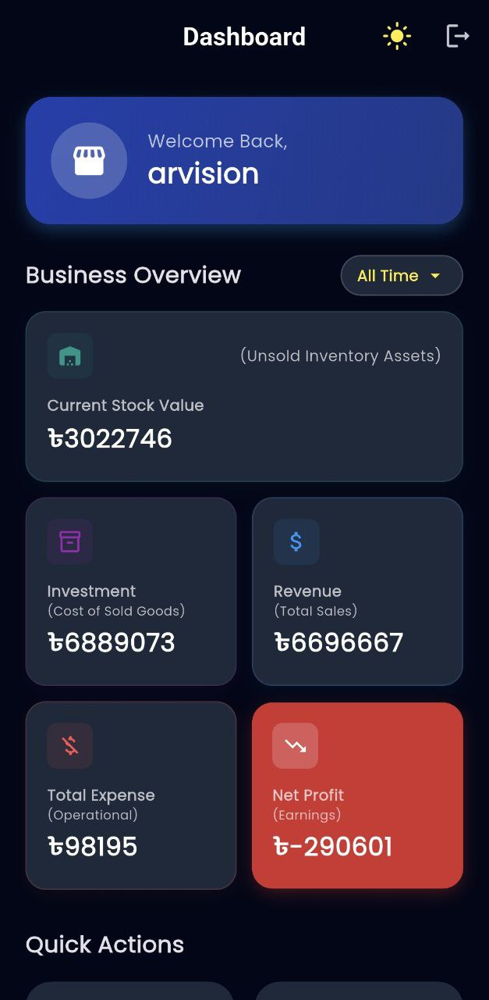
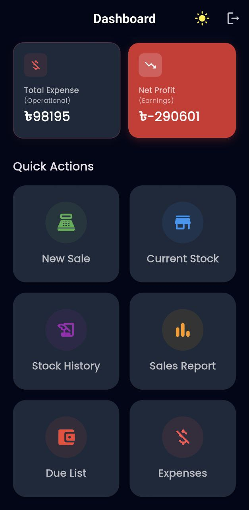
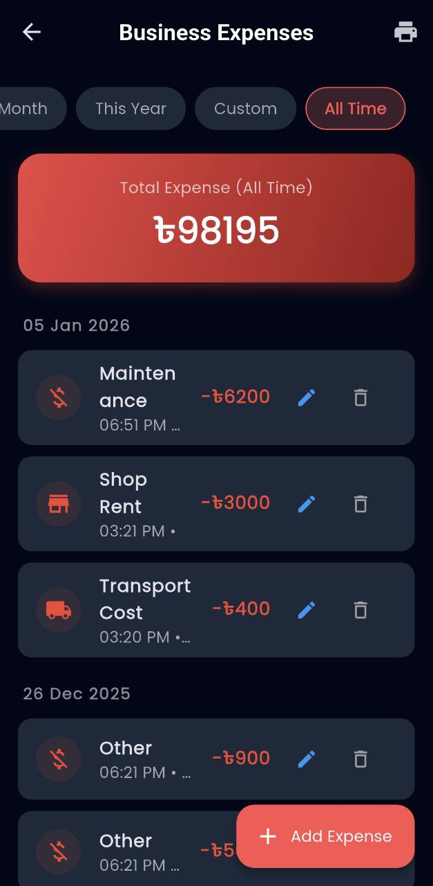

# 🛒 Vision Mart - Inventory & POS Management System

**Vision Mart** is a robust, Flutter-based Inventory and Point of Sale (POS) management application designed for small to medium-sized retail businesses (specifically optimized for Electronics/Appliance stores). It streamlines daily operations including stock management, sales invoicing, due tracking (Khata), expense recording, and business analytics.

Built with **Flutter** and **Firebase**, utilizing **Riverpod** for state management to ensure a scalable, reactive, and transactional (ACID-compliant) architecture.

---

## 📱 Key Features

### 📦 Advanced Inventory Management

* **Batch Receiving:** Efficiently add multiple products at once with a "Batch Inward Challan" system.
* **Smart Pricing Calculator:** Auto-calculates Commission % or Flat Discount based on MRP and Buying Price inputs.
* **Stock History & Logs:** View granular history of every batch received.
* **Correction Mode:** Unique "Correct Mistake" logic that handles moving stock between models or updating details using ACID transactions to ensure data integrity.
* **Challan Printing:** Generate and print PDF Inward Challans for physical record-keeping.
* **Low Stock Alerts:** Visual indicators for items running low on quantity.

### 💰 Point of Sale (POS)

* **Dynamic Cart System:** Add items, adjust quantities, and toggle between Percentage (%) or Flat (Tk) discounts per item.
* **Global Discounting:** Apply a global discount to the total bill which automatically prorates (distributes) the discount across all items for accurate profit calculation.
* **Invoice Preview:** Review the invoice PDF before finalizing the sale to prevent errors.
* **Stock Validation:** Real-time checks prevent selling more items than physically available.
* **Sales Correction:** Edit existing invoices or **Delete Invoices** with automatic **Stock Restoration** (reverts items back to inventory).

### 📒 Due Management (Khata) & Deadlines

* **Track Dues:** Monitor customers with outstanding balances.
* **Payment Deadlines:** Set specific payment dates. Includes a **Countdown Timer** (e.g., "3 days left" or "Overdue") for urgency.
* **Searchable List:** Quickly find dues by Customer Name, Phone, or Invoice ID.
* **Partial Payments:** Record partial payments; the system automatically calculates the remaining balance.
* **Money Receipts:** Generate professional PDF money receipts for every payment transaction.

### 📊 Analytics & Business Intelligence

* **Live Dashboard:** Real-time overview of:
* **Current Stock Value:** Value of unsold assets.
* **Investment:** Cost of goods sold.
* **Net Profit:** Actual earnings after expenses.


* **Advanced Reporting:**
* **Profit/Loss Filters:** Toggle to see only profitable sales or loss-making transactions.
* **Search:** Find specific historical invoices by ID or Customer Name.


* **Date Ranges:** Analyze by Today, Yesterday, This Week, Month, Year, or Custom Range.

### 💸 Expense Tracking

* **Batch Entry:** Add multiple expense items (e.g., Rent, Tea, Salary) in one go.
* **Expense Reports:** Generate PDF reports for expenses within specific periods.
* **Categorization:** Pre-defined categories for easier financial sorting.

### 🔐 Authentication & Security

* **Admin Login:** Secure Email/Password authentication via Firebase Auth.
* **Password Reset:** Built-in "Forgot Password" flow to send reset emails.
* **Transactional Integrity:** Uses Firestore Transactions/Batches to ensure money and stock numbers never go out of sync during failures.

### 🎨 UI & UX

* **Adaptive Theme:** Fully optimized high-contrast **Dark Mode** (Slate/Blue/Yellow palette) and Clean Light Mode.
* **Material 3 Design:** Modern UI components, cards, and typography.
* **Responsive Layouts:** Optimized for tablets and phones.

---

## 🛠️ Tech Stack

* **Framework:** [Flutter](https://flutter.dev/)
* **Language:** [Dart](https://dart.dev/)
* **Backend:** [Firebase](https://firebase.google.com/)
* **Authentication:** Admin management.
* **Cloud Firestore:** NoSQL Database (Heavily uses `runTransaction` and `WriteBatch`).


* **State Management:** [Flutter Riverpod](https://pub.dev/packages/flutter_riverpod) (v2.x)
* **PDF Generation:** `pdf` & `printing` packages (Thermal & A4 support).
* **Formatting:** `intl` (Currency and Date formatting).

---

## 📂 Project Structure

The project follows a **Feature-First (Layered)** architecture:

```text
lib/
├── firebase_options.dart      # Firebase Configuration
├── main.dart                  # Entry point & Theme Provider
└── src/
    ├── services/              # Global services (AuthService)
    └── features/
        ├── authentication/    # Login, Forgot Password
        ├── inventory/         # Product Model, Repo, Add/Edit/Receive Screens
        ├── sales/             # POS Cart, Discount Logic, PDF Generator
        ├── analytics/         # Dashboard, Profit Calculation, Sales Detail
        ├── expenses/          # Batch Expense Entry, Reports
        └── due_management/    # Deadline Timer, Payment Processing


```

---

## 🚀 Getting Started

### Prerequisites

* Flutter SDK installed.
* A Firebase Project created.

### Installation

1. **Clone the repository:**
```bash
git clone https://github.com/your-username/vision-mart-app.git
cd vision-mart-app

```


2. **Install dependencies:**
```bash
flutter pub get

```


3. **Firebase Setup:**
* This project relies on Firebase. You must configure your own Firebase project.
* Run `flutterfire configure` to generate the `firebase_options.dart` file.
* **Enable:** Authentication (Email/Password) and Cloud Firestore in your Firebase Console.


4. **Run the app:**
```bash
flutter run

```


---

## 📸 Screenshots

| Dashboard-1 | Dashboard-2 | Current stock |
|:---:|:---:|:---:|
|  |  |  |
| Stock Detailed | Receive Stock | New Sale|
|:---:|:---:|:---:|
|  |  |  |
| Invoice Detailed | Sales Report All | Sales Report Profit Only |
|:---:|:---:|:---:|
|  |  |  |
| Sales Report Loss Only | Due List Screen | Due List Payment Dialog |
|:---:|:---:|:---:|
|  |  |  |
| Expanse List | Add Expanse List Dialog |  |
|:---:|:---:|:---:|
|  |  |  |

---

## 📝 Configuration

### PDF Generation

The app generates:

* **A4 Invoices:** For Sales and Inventory Challans.
* **A6 Receipts:** For Due Payments (Money Receipts).
* Ensure a PDF viewer is available on the device, or connect to a thermal/standard printer via the print preview dialog.

---

## 🤝 Contributing

Contributions are welcome! Please follow these steps:

1. Fork the project.
2. Create your feature branch (`git checkout -b feature/AmazingFeature`).
3. Commit your changes (`git commit -m 'Add some AmazingFeature'`).
4. Push to the branch (`git push origin feature/AmazingFeature`).
5. Open a Pull Request.

---

## 📄 License

This project is licensed under the MIT License.

---

**Developed for A & R Vision Mart.**